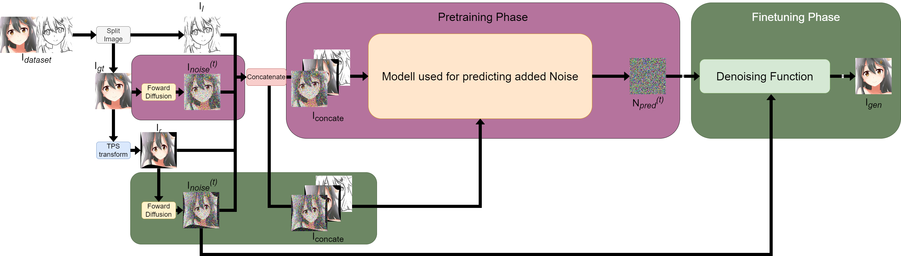
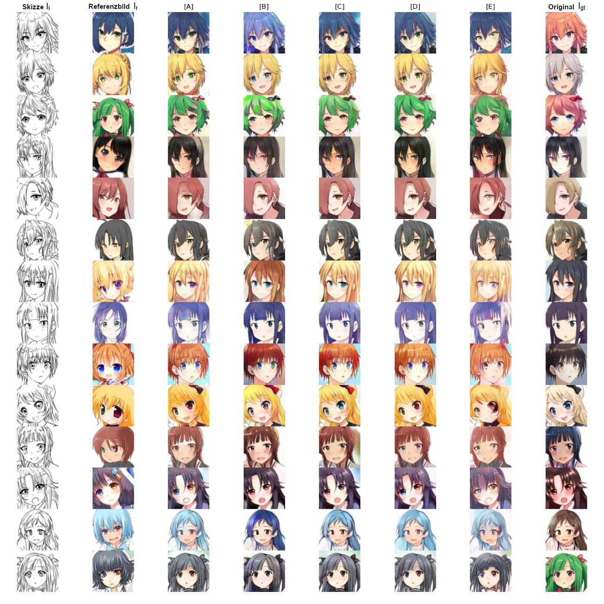
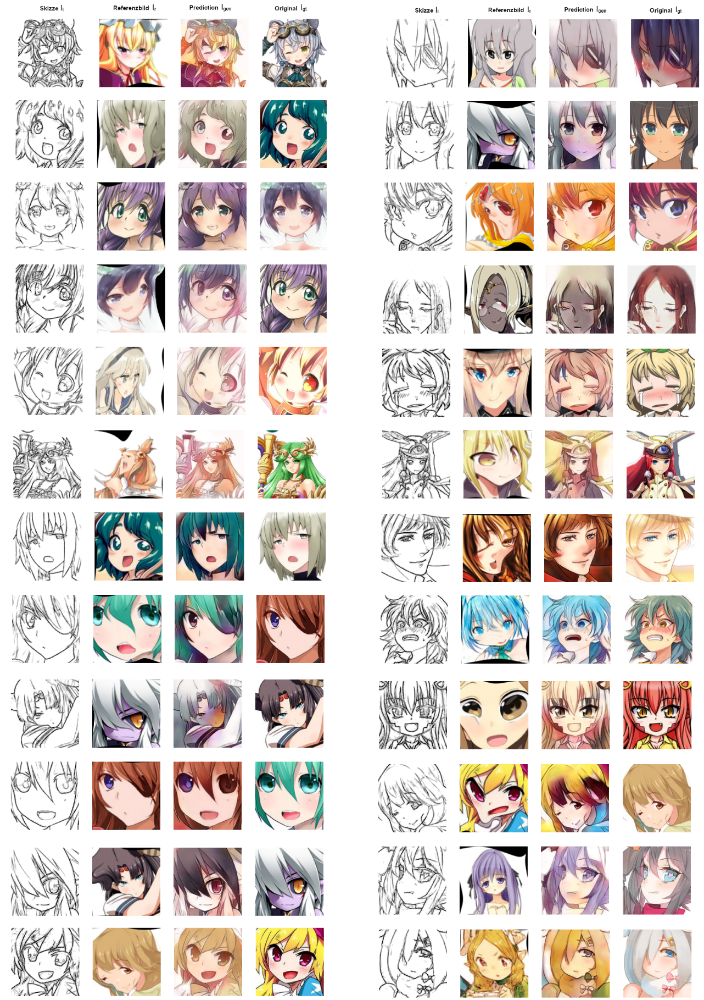
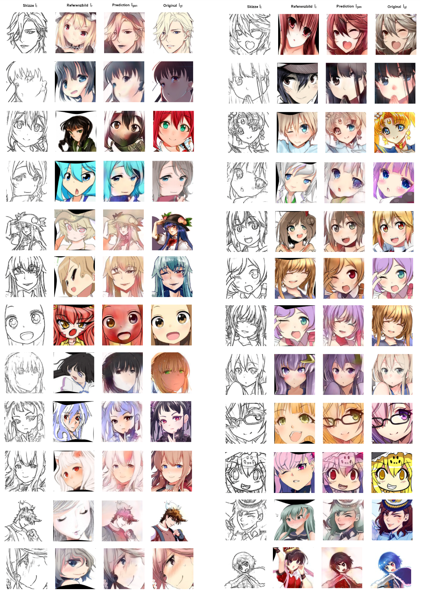

# Coloring Assistant based on a Diffusion Model
This following project contains the code to my bachelor thesis about an implementation of a Coloring Assistant based on a Diffusion Model. (Similar to [AnimeDiffusion](https://arxiv.org/abs/2303.11137) paper)

In my implemention I tried to minimalize the training duration, resulting in a smaller model architecture and smaller images.

The final model was trained for 16h in the pretraining phase and 22h in the finetuning phase on a RTX 3060. Also it is possible to train on a GPU with even less VRAM, because of the loss is calculated after every sampling step. This is similar to an algorithm used in the [DiffusionCLIP](https://arxiv.org/abs/2110.02711) paper. In my implementation I tried different configuration after which the loss is calculated, resulting in the following code snippet:

```python
if I_gt_hat.requires_grad and counter == self.every_n_samples_loss-1:
                opt = self.optimizers()
                opt.zero_grad()
                loss = F.mse_loss(colored_image, I_gt_noise)
                self.manual_backward(loss)
                opt.step()
            counter += 1
```


## Dataset
For training a modified version of the Dataset [Anime Sketch Colorization Pair](https://www.kaggle.com/datasets/ktaebum/anime-sketch-colorization-pair) is used, in which every face is cropped to a 128x128 image. Each image pair consists of a colorized and a sketched version.

Here are two examples from the modified Dataset:


## Training Process
The training process is being split into a **pretraining** and a **finetuning** phase.

During the **pretraining** phase the model learns to predict the added noise to I<sub>gt</sub> (I<sub>noise</sub><sup>(t)</sup>), resulting in N<sub>pred</sub><sup>(t)</sup> as an output. I<sub>l</sub> and I<sub>r</sub> are also used in the concated input I<sub>concate</sub> to provide additional conditions which later can be used in the colorization process.

During the **finetuning** phase the model learns to colorize I<sub>l</sub> based on I<sub>r</sub>. In this phase, noise is added to **I<sub>r</sub>** instead of I<sub>gt</sub> to create a dependency onto the reference image instead of the original. During training phase I<sub>r</sub> is a tps transformed version from I<sub>gt</sub>. After training, I<sub>r</sub> every image can be used regardless of being tps transformed or not. 





## Comparison
For my comparison the images for the models
[A] - [D] are taken from [AnimeDiffusion](https://arxiv.org/abs/2303.11137). I assume a comparison is valid, because of the similarity between the colorization task. In my case I upscaled my img to 256x256 to match the other images.

* [A] [Reference_Based Sketech Image Colorization](https://arxiv.org/pdf/2005.05207.pdf)
* [B] [Eliminating Gradient Conflict in Reference-based Line-Art Colorization](https://arxiv.org/pdf/2207.06095.pdf)
* [C] [Attention-Aware Anime Line Drawing Colorization](https://arxiv.org/pdf/2212.10988.pdf)
* [D] [AnimeDiffusion](https://arxiv.org/abs/2303.11137)
* [E] own trained model




## Results

Here are some additional results for my trained colorization model:





